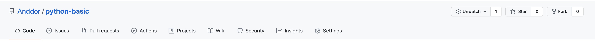
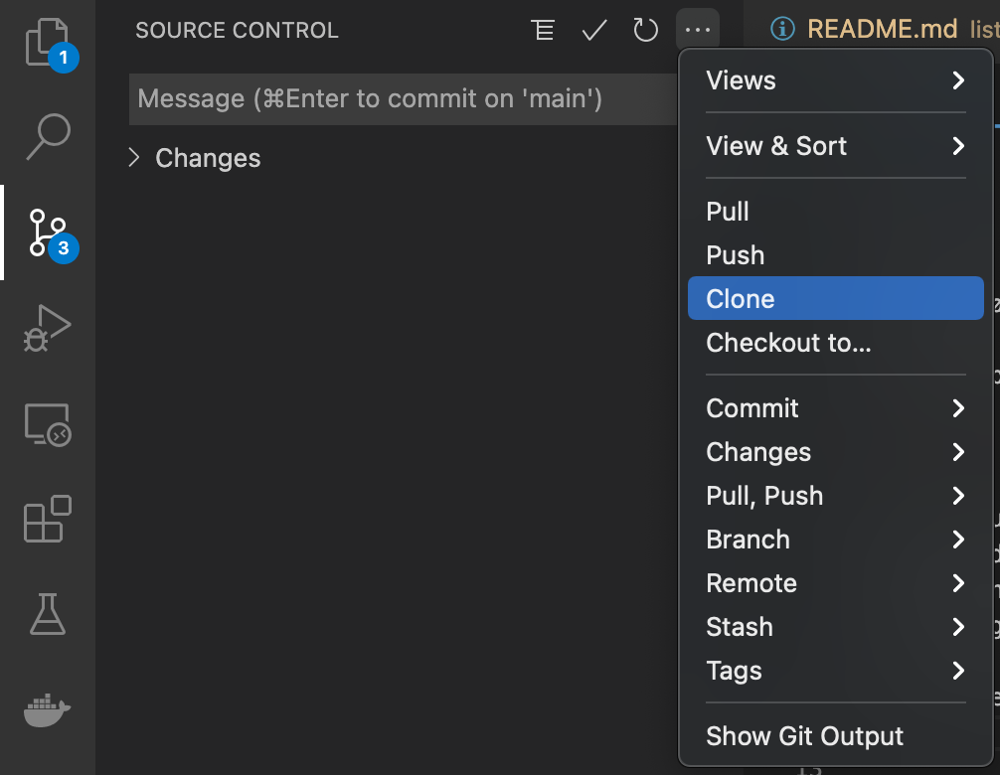
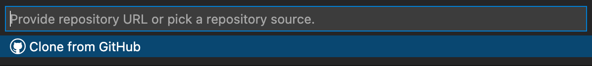

# python-basic

Dette er et repo med oppgaver vi skal bruke til å gå over alt vi trenger for å komme igang med Python!

For å gjøre oppgavene skal du lage en "fork" av repoet. En fork lager din egen kopi av et helt repo som du selv kan gjøre endringer på. For å lage en fork i GitHub, trykker du på Fork-knappen helt øverst til høyre i et repo:



Da vil du ha et nytt repo i din egen bruker som du kan pushe til så mye du vil. For å gjøre endringene må du laste ned repoet til din maskin med `clone`. Trykk på "Code"-knappen i ditt og kopier adressen. 

Den kan du skrive inn i Visual Studio Code:



Eller i git i terminalen:
```bash
git clone git@github.com:Anddor/python-basic.git (MED ADRESSEN TIL DITT REPO)
```

## Rekkefølge:

* [Variabler og Datatyper](./variables)
* [Betingelser](./conditionals)
* [Lister](./lists)
* [Løkker](./loops)
